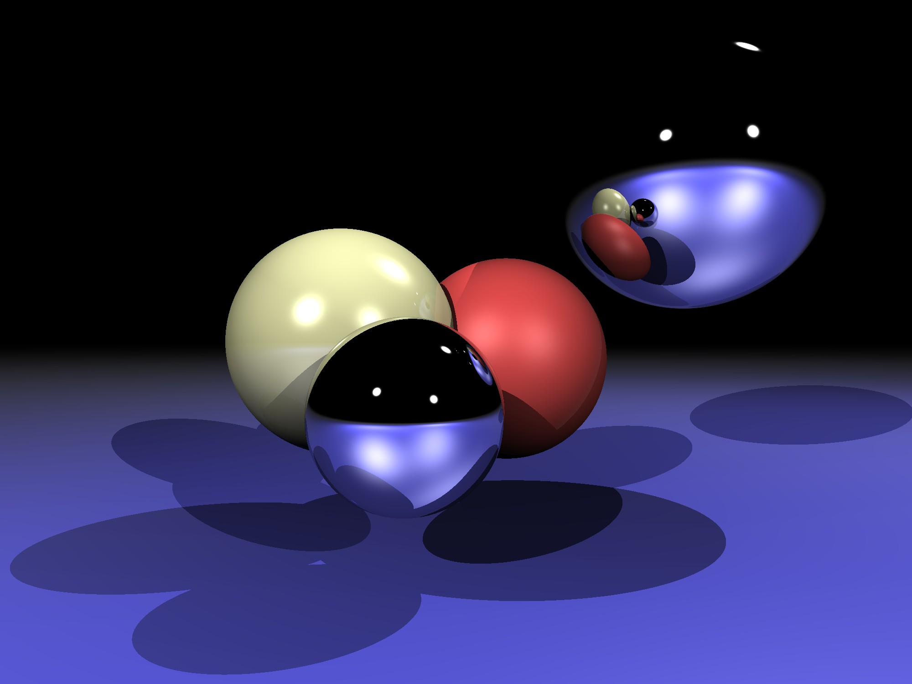

# Lisa Ray-Tracer

This is a very simple (~200 LoC) toy ray-tracer, largely based on [tinyraytracer](https://github.com/ssloy/tinyraytracer).

### Example

### Features

- Basic shapes: spheres and infinite planes
- Point lights with hard shadows
- Simple diffuse and specular lighting (phong reflection)
- Reflective and refractive materials